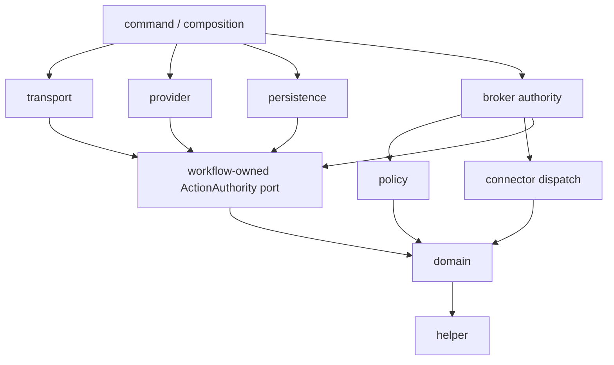

# COH Go workspace and dependency-boundary contract

| Field | Value |
|---|---|
| Issue | COH-E02-01 / CYB-32 |
| Requirements | NFR-019, NFR-026; security alignment SEC-002 |
| Contract | `coh.architecture/v1`, version `1.0.0` |
| Go baseline | `1.26.7` |
| Owner | COH maintainers |
| Status | Implemented; independent review required before Done |
| Last reviewed | 2026-08-19 |

## Decision

COH uses one Go module and workspace at the repository root. Production code is
organized as inward-pointing boundaries and checked from the actual import graph.
The executable contract is
[`workspace-contract.json`](../../contracts/architecture/v1/workspace-contract.json),
with its formal
[`JSON Schema`](../../contracts/architecture/v1/workspace-contract.schema.json).

The LLM, workflow, provider, transport, and command layers are not authorization
boundaries. A workflow can submit a digest-bound `ToolIntent` only through its
own narrow `ActionAuthority` port. Only the broker boundary can compose policy
evaluation with connector dispatch. This makes SEC-002 a compile-time import
constraint in addition to a later runtime control.

## Workspace layout

```text
go.work / go.mod
├── cmd/                         thin entry points
├── contracts/architecture/v1/  schema, policy, and fixtures
├── internal/
│   ├── command/                 native composition root
│   ├── broker/                  sole action authority
│   ├── domain/                  types and invariants
│   ├── policy/                  authorization decisions
│   ├── workflow/                use cases and inward-owned ports
│   ├── provider/                model adapters
│   ├── connector/               bounded external-system dispatch
│   ├── persistence/             metadata and artifact adapters
│   ├── transport/               REST, SSE, gRPC, and CLI translation
│   ├── ui/                      immutable Web asset bundle
│   └── helper/                  dependency-free utilities and checks
└── scripts/                     bounded build and verification entry points
```

`cmd/coh-brokerd` is classified as broker, not command, because it is the narrow
security-sensitive composition root allowed to wire policy and connectors. The
longest declared source root wins. Any unclassified local Go package is denied.

## Boundary rules

| Boundary | May import | Must not own |
|---|---|---|
| `helper` | `helper` | Product rules, I/O authority, credentials |
| `domain` | `domain`, `helper` | Side effects, policy, orchestration |
| `policy` | `domain`, `helper`, `policy` | Connector dispatch, transport concerns |
| `workflow` | `domain`, `helper`, `workflow` | Connector, policy, runner, or adapter implementations |
| `provider` | `domain`, `helper`, `provider`, `workflow` | Connector dispatch or authorization |
| `connector` | `connector`, `domain`, `helper` | Policy decisions, generic shell/HTTP passthrough |
| `persistence` | `domain`, `helper`, `persistence`, `workflow` | Business or authorization decisions |
| `broker` | `broker`, `connector`, `domain`, `helper`, `policy`, `workflow` | UI or transport behavior |
| `ui` | `helper`, `ui` | Go runtime logic or action authority |
| `transport` | `domain`, `helper`, `transport`, `ui`, `workflow` | Concrete provider, connector, persistence, policy, or broker calls |
| `command` | `broker`, `command`, `domain`, `helper`, `persistence`, `provider`, `transport`, `ui`, `workflow` | Domain logic, policy evaluation, connector dispatch |

Rules are intentionally allowlists:

- `ARCH-001` denies a local package or import outside a declared boundary.
- `ARCH-002` denies a dependency not listed in `may_import`.
- A contract whose roots or allowlist differs from locked v1 policy is denied
  before the graph is checked.
- Production, internal, and external-test imports are all evaluated.
- Every tracked or non-ignored `.go` file is parsed independent of build tags;
  the active `go list` graph is merged into that all-source graph.
- Any nested `go.mod` or `go.work` in the same source set is denied because it
  could otherwise escape root-module discovery.
- Standard-library and third-party imports are outside this boundary check and
  remain subject to dependency, license, vulnerability, and provenance gates.

The graph is directional:



There is deliberately no `workflow → connector`, `provider → connector`, or
`transport → connector` edge. Future agent packages live within the workflow
boundary unless a reviewed contract version creates a narrower boundary, so an
agent-to-connector import is denied too. A future runner package is unclassified
and denied until a reviewed schema and policy version defines its isolation.

These package boundaries do not collapse trust zones. The provider package is
the trusted model gateway; the remote or local model and all model-produced data
remain untrusted. The connector package is trusted bounded adapter code, while
the SIEM, scanner, CTI service, and their returned content remain external and
untrusted. Explicit fixtures deny remote-transport, provider, workflow, and
composition-root attempts to reach connector dispatch outside the broker.

## Canonical contract and schema behavior

The executable checker uses a closed, strict Go representation and rejects:

- empty, malformed, oversized, or trailing JSON;
- unknown fields or duplicate/unknown boundaries;
- unsupported schema, contract, canonicalization, module, or Go versions;
- missing roots, blank purposes, path traversal, and duplicate roots; and
- any attempt to widen the locked v1 import policy.

Root manifests are checked inputs. `go.mod` must declare the exact module, Go
`1.26.7`, and toolchain `go1.26.7`; replacement directives are denied. Normal
dependency directives remain available to later supply-chain work. `go.work`
must declare the same Go/toolchain baseline and exactly `use .`; extra workspace
modules and replacement directives are denied.

`COH-JSON-C14N-1` is a type-specific canonical encoding, not a claim of general
RFC 8785 support. It emits the fixed schema field order, sorts boundaries, roots,
and import sets lexically, uses compact UTF-8 JSON, and emits no terminal newline.
The checker records the SHA-256 digest of those bytes in every report. The
canonical positive fixture is immutable review evidence.

The JSON Schema provides editor and external-tool validation. The executable
validator is authoritative because it additionally pins exact boundary roots and
allowlists. Schema constraints such as the 240-code-point purpose limit are also
tested for reader parity. Conversion or schema validity alone never grants a
dependency.

In a Git checkout, the source set combines `git ls-files --cached --others
--exclude-standard` with every Go/module/workspace file below `cmd` and
`internal`, even if ignored. Explicit ignore policy can therefore exclude UI
dependencies and SSD working data but cannot hide a platform-only core bypass.
In a source archive, the fallback walker excludes the documented generated and
temporary directory names. Layout validation and source parsing share this
scope, then layout and file digests are reverified before the verdict emits. If
an ignored package outside the core roots is nevertheless active, `go list`
merges it into the graph and its unclassified path is denied.

## Failure, cancellation, and recovery

| Condition | Behavior | Exit |
|---|---|---|
| Valid contract and graph | Emit an `allowed` report with digest and zero violations | `0` |
| Forbidden or unclassified edge | Emit complete deterministic denial report | `2` |
| Invalid or incompatible contract | Reject before graph discovery | `1` |
| Invalid CLI arguments | Show bounded usage error | `64` |
| Deadline, SIGINT, or SIGTERM | Cancel `go list`; preserve `context` cancellation | `130` |
| Go discovery/tool failure | Return a typed, bounded diagnostic; never infer success | `1` |
| Evidence output sink fails | Return failure; never report success with truncated evidence | `1` |

The checker is read-only and has no recovery journal. A denial, timeout, or crash
cannot partially update policy or provenance; rerunning against the same canonical
contract and source graph deterministically recovers. Reports contain the contract
and import-graph digests, separate Go-source and combined input-manifest digests,
VCS revision/dirty state,
actual Go version, GOOS, GOARCH, build tags, package/file counts, rule IDs, and
exact denied import edges. Imports are parsed and per-file hashes are computed
from the same byte buffer, then files are reverified before evidence emits. A
canceled discovery still emits the available contract/runtime provenance. Reports
contain no source content, credentials, environment values, or model authority.

## Go toolchain and SSD storage

[`go.mod`](../../go.mod) and [`go.work`](../../go.work) both pin Go `1.26.7` and
the local toolchain. Repository scripts source
[`go_ssd_env.sh`](../../scripts/lib/go_ssd_env.sh), which keeps `GOCACHE`,
`GOMODCACHE`, `GOPATH`, and `GOTMPDIR` beneath
`/Volumes/Untitled/Codex/toolchains` by default and sets `GOTOOLCHAIN=local`.
It sets `GOENV=off` and relocates `XDG_CONFIG_HOME` and `XDG_CACHE_HOME` beneath
the approved toolchain root. On XDG platforms, it publishes exact `off` mode
bytes with a same-directory, no-replace hard-link commit and accepts an existing
mode only after stable identity, ownership, permission, and content checks. Go
never overwrites that pathname. Go ignores XDG configuration relocation on
macOS. Native macOS runs with `HOME` set stable-read the existing mode before
the first Go invocation and fail unless it is already `off`; scrubbed children
without `HOME` proceed because Go cannot address a user configuration directory.
Neither case persists telemetry settings. This prevents telemetry collection or
uploads without writing outside
approved mutable storage, and prevents implicit toolchain downloads
and mutable Go data on the internal drive. Operators can override
`COH_TOOLCHAIN_ROOT` and `COH_GO_ROOT` explicitly.

Run the contract gate with:

```sh
scripts/check_go_architecture.sh
scripts/test_go_contract.sh
```

## Versioning and compatibility

The detailed policy is in the
[`compatibility matrix`](go-workspace-compatibility.md). In short, this reader
accepts `coh.architecture/v1` contracts in the `1.0.x` line only. New fields,
roots, import edges, boundary semantics, or a baseline promotion require a
reviewed reader and fixture change; they never activate silently.

## Alternatives and non-goals

Rejected alternatives:

- Convention-only package rules: drift would not fail CI.
- A generic linter dependency: avoidable supply-chain and offline-bootstrap cost.
- Interfaces owned by adapters: this reverses dependency direction and couples
  use cases to implementations.
- Direct workflow connector ports: this bypasses the broker and violates SEC-002.
- A command layer allowed to import connector or policy: composition convenience
  is not sufficient reason to weaken the action boundary.
- Separate Go modules per boundary now: they increase release and local-workspace
  complexity before independent versioning is needed.

This issue does not implement vendor adapters, broker policy, approvals, audit,
credentials, action execution, runner isolation, or a silent compatibility
promise. It establishes the import contract those implementations must obey.

## Traceability and approval

- NFR-019: thin commands/transports and automated package boundaries are encoded
  in the contract and checked from `go list` output.
- NFR-026: module, workspace, scripts, contract, and validator pin Go `1.26.7`;
  Go `1.27` remains unqualified.
- SEC-002: workflows submit typed intent only through `ActionAuthority`; explicit
  denial fixtures cover workflow/provider-to-connector bypasses.
- COH-E02-01: schema, canonical fixture, negative fixtures, compatibility matrix,
  and test evidence are separately reviewable.

Implementation status is complete. CYB-32 must remain out of Done until the
required independent reviewer approves the contract and the evidence report is
attached to the issue.
