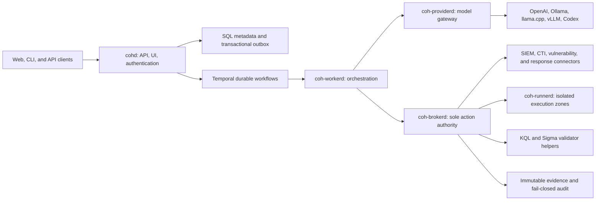

# Cyber Operations Harness (COH)

## Product Requirements Document

| Field | Value |
|---|---|
| Status | Approved implementation baseline |
| Research snapshot | 2026-08-19 |
| Product | Cyber Operations Harness (COH) |
| License | Apache-2.0 |
| Initial audience | Solo cybersecurity analyst, with multi-actor controls from day one |
| Deployment | Native-first; optional full Docker Desktop/Compose; connected or air-gapped |
| Trusted core | Go |
| Durable workflow engine | Temporal behind an internal `WorkflowEngine` port |
| Server persistence | PostgreSQL 18 |
| Workstation persistence | SQLite and a local content-addressed evidence store |
| Tier 1 platforms | macOS 14+ arm64, Linux amd64, Linux arm64/NVIDIA DGX Spark, Docker Desktop/Engine |

This document is the normative product contract. “Shall” denotes a release-blocking requirement. Requirement identifiers are stable and must be referenced by implementation issues, tests, architecture decisions, and release evidence.

## 1. Product definition

COH is a standalone, evidence-centered LLM harness for defensive cybersecurity operations. It combines durable agent workflows with deterministic policy enforcement, bounded data access, immutable evidence, exact approvals, and isolated execution. It assists with alert investigation, SIEM querying, correlation and timelines, incident response, threat hunting, detection engineering, threat intelligence, vulnerability management, authorized validation, and analyst reporting.

The model is an untrusted planner and analyst. It is never an identity, authorization, policy, credential, or execution boundary. All consequential actions pass through the trusted broker and deterministic policy controls.

### 1.1 Problem statement

General-purpose agent harnesses can reason and use tools, but typical designs assume a trusted personal operator, weakly durable sessions, broad tool access, and best-effort audit. Cyber operations require stronger guarantees: evidence provenance, tenant and case separation, bounded queries, exact approvals, durable recovery, honest partial-result handling, and containment of hostile data and active-testing tools.

### 1.2 Goals

- Make routine SOC work faster without weakening analyst control or evidentiary integrity.
- Support local models, hosted models, and external-agent runtimes through explicit capability-qualified adapters.
- Produce findings and reports whose claims resolve to immutable evidence.
- Permit bounded read-only automation by default and progressively controlled higher-risk actions.
- Operate natively without Docker while offering an equivalent optional container stack.
- Remain usable in a fully air-gapped environment.
- Provide a modular Go codebase in which ordinary source files remain small and responsibilities remain explicit.

### 1.3 Success measures

- A solo analyst can install COH, create a case, qualify a model, run a bounded SIEM investigation, build a timeline, and export a signed evidence package without Docker.
- The same workflow operates through Web, CLI, and API and passes contract-equivalence tests in native and Compose profiles.
- The adversarial suite produces zero unauthorized side effects, cross-case disclosures, approval replays, scope escapes, or direct model-to-executor actions.
- At least 95% of evaluated factual claims carry valid evidence citations, with zero fabricated artifact identifiers.
- Every policy decision and side effect appears in the tamper-evident audit chain.
- Production T4 validation is impossible until two distinct human approvers and every signed rule-of-engagement prerequisite are present.

### 1.4 Personas

| Persona | Responsibilities | Default authority |
|---|---|---|
| Analyst | Investigate, hunt, develop detections, triage vulnerabilities, prepare response actions | T0–T1; may request T2–T4 |
| Approver | Review an exact action, evidence, scope, rollback, and risk | May approve within assigned policy; cannot approve own T4 request |
| Administrator | Configure identity, connectors, runners, providers, retention, and policy bundles | Configuration only; action authority remains policy-bound |
| Auditor | Inspect cases, evidence lineage, approvals, policy decisions, and audit verification | Read-only |
| Service actor | Run connector, provider, workflow, or runner operations | Narrow machine identity and leased capability only |

The initial deployment may have one analyst-administrator. This does not relax
T4 separation of duties: T4 remains unavailable until two distinct eligible
non-requestor human approvers are enrolled. A human-requested T4 action therefore
normally requires at least three distinct enrolled humans: one requestor and two
approvers.

### 1.5 In scope

- Web, CLI, and REST/SSE operator experiences.
- Case, run, task, evidence, timeline, entity, hypothesis, finding, and report lifecycles.
- OpenAI Responses, Ollama, llama.cpp, vLLM, and Codex App Server/SDK integrations.
- Elastic, Security Onion, Splunk, and Microsoft Sentinel/Log Analytics query integrations.
- Sigma-based detection development, validation, testing, promotion, and rollback.
- ATT&CK, D3FEND, CWE, STIX/TAXII, CVE, NVD, KEV, EPSS, OSV, SBOM, VEX, CSAF, and SARIF data.
- Bounded integrations for Syft, Trivy, Grype, Nmap, Nuclei, ZAP, external Greenbone/OpenVAS, and a curated T4 Metasploit proxy.
- Native workstation/server installation, optional Docker Compose, and signed air-gap bundles.

### 1.6 Non-goals

- Unsupervised production remediation or containment.
- Replacing a SIEM, log lake, scanner manager, SOAR platform, or enterprise identity provider.
- Model-visible credentials, arbitrary model-controlled HTTP, generic remote shells, or unrestricted command execution.
- Self-modifying production skills or automatic promotion of model-generated policy, detections, or tools.
- Unrestricted exploitation, arbitrary Metasploit RPC, payload generation, persistence, lateral movement, evasion, or automatic scope expansion.
- Token-identical LLM replay; deterministic control-plane state and evidence replay are required instead.
- Windows-native v1 support. Windows is best-effort Docker-only and is not a release gate.

## 2. Product principles and action authority

1. Evidence before assertion: material claims resolve to immutable evidence or are marked as hypotheses.
2. Deterministic authority: policy, identity, approvals, credentials, and target scope are enforced outside the model.
3. Least privilege by construction: every connector, runner, and service receives only the capability required for one bounded task.
4. Honest uncertainty: partial, truncated, stale, conflicting, and indeterminate results are explicit states.
5. Durable control plane, disposable execution: workflows and evidence survive process loss; risky execution environments do not.
6. Native and air-gap operation are first-class; containers are an optional packaging and isolation mechanism, not a prerequisite.
7. Progressive autonomy is earned through evaluation and policy, not inferred from model confidence.

### 2.1 Action tiers

| Tier | Examples | Default disposition | Approval rule |
|---|---|---|---|
| T0 | Offline analysis, correlation, summarization, derived artifacts | Automatic | None |
| T1 | Bounded read-only queries to pre-authorized sources | Automatic | Pre-authorization in policy |
| T2 | Reversible mutations such as draft publication or reversible workflow updates | Held for approval | One exact, expiring approval |
| T3 | Containment, destructive changes, intrusive scanning | Held for approval | Explicit approval; policy may require two |
| T4 | State-changing validation against production | Denied unless every prerequisite passes | Two distinct human approvers, neither the requestor |

## 3. Architecture

### 3.1 Process topology

| Process | Normative responsibility | Forbidden responsibility |
|---|---|---|
| `coh` | CLI, bootstrap, native supervision, backup, restore, diagnostics | Direct connector or action execution |
| `cohd` | REST/SSE, embedded Web UI, authentication, projections, transactional outbox | Model calls and consequential side effects |
| `coh-workerd` | Temporal workflows, agent phases, recovery, budgets, bounded delegation | Credentials and direct external actions |
| `coh-providerd` | Provider adapters, capability qualification, data-route policy, model provenance | Tool authorization and execution |
| `coh-brokerd` | Policy, approvals, credential leases, connectors, action dispatch, evidence, audit | Autonomous model reasoning |
| `coh-runnerd` | Execute one signed, leased action in an assigned isolation zone | Scope changes, policy decisions, or reusable credentials |

Trusted local calls use versioned protobuf/gRPC over permission-restricted Unix sockets. Remote calls require mutually authenticated TLS, enrolled service identities, short-lived certificates, and explicit runner capabilities.

### 3.2 Approved helpers

The trusted Go core may invoke only two non-Go validation helpers in v1:

- A self-contained .NET helper using Microsoft `Kusto.Language` for Sentinel query parsing and analysis.
- A self-contained Python helper using pinned pySigma packages for Sigma validation and compilation.

Helpers shall be signed, version-pinned, credentialless, network-denied, read-only apart from an ephemeral work directory, resource-limited, and driven through bounded typed input/output. Unavailability, timeout, malformed output, signature failure, or version mismatch denies the dependent operation.

### 3.3 Workflow boundary

Temporal is accessed only through an internal `WorkflowEngine` interface. Workflow histories contain identifiers, hashes, bounded status data, and retry metadata—not raw evidence, secrets, full prompts, or large model/tool outputs. Activities resolve immutable artifacts by reference.

Consequential actions use this state machine:

`planned → policy_checked → awaiting_approval → prepared → executing → confirmation_pending → verified | compensated | uncertain | denied | cancelled`

An operation with an indeterminate remote outcome transitions to `uncertain`, freezes automatic retries, and requires connector-specific reconciliation or human resolution.

## 4. Public contracts and canonical data

### 4.1 External interfaces

- REST/JSON is rooted at `/api/v1` and described by OpenAPI 3.1.
- Route groups are `cases`, `runs`, `tasks`, `evidence`, `timelines`, `entities`, `queries`, `providers`, `connectors`, `detections`, `vulnerabilities`, `roes`, `actions`, `approvals`, `policy`, `audit`, `runners`, `health`, and `capabilities`.
- Mutating requests require `Idempotency-Key`. Updates and deletes of mutable resources also require ETag/`If-Match` optimistic concurrency.
- Errors use RFC 9457 problem details and include a stable type URI, correlation identifier, safe detail, and retry classification.
- Server-sent events support `Last-Event-ID`, bounded replay, case/run filters, ordered per-stream delivery, and explicit retention-gap errors.
- Identifiers use UUIDv7. Timestamps use RFC 3339 nanosecond UTC while retaining original timezone, source precision, and clock uncertainty.
- CLI human output and stable `--json` output call the same API contracts used by the Web UI.

### 4.2 Canonical types and invariants

| Type | Required invariants |
|---|---|
| `Case` | Organization, tenant, owner, classification, state, retention policy, created/updated versions |
| `Run` | Case, initiating actor, workflow type/version, policy revision, provider route, status, budgets |
| `Task` | Parent/run, durable state, attempt, lease, deadline, inputs/outputs by immutable reference |
| `EvidenceRef` | Digest, media type, length, classification, access scope, manifest reference |
| `ArtifactManifest` | Source, collection/source time, time range, transformation lineage, tool/query/model versions |
| `Finding` | Status, severity, confidence, evidence, counterevidence, owner, disposition |
| `Claim` | Exact statement, evidence references, confidence, author, creation context |
| `Hypothesis` | Supporting/refuting evidence, unknowns, next tests, status; never represented as fact |
| `TimelineEvent` | Normalized and original times, uncertainty, source, entity links, evidence reference |
| `Entity` | Tenant-scoped type, normalized value, aliases, confidence, provenance |
| `QueryRequest` | Connector, tenant/resource, half-open UTC range, purpose, mode, limits, native query |
| `ValidatedQueryPlan` | Parsed form/hash, schema revision, enforced bounds, estimated risk/cost, validator version |
| `QueryPage` | Rows/artifact, completeness, continuation/slice state, statistics, source response metadata |
| `ToolIntent` | Tool/version, exact arguments/targets, tier, case, actor, ROE and policy references |
| `PolicyDecision` | Input digest, result, reasons, obligations, policy bundle/version, evaluation time |
| `Approval` | Action digest, approver, validity, use count, policy/ROE digests, decision and reason |
| `ActionReceipt` | Action digest, runner/tool identity, start/end, external identifiers, outcome, evidence |
| `ROE` | Signed scope, exclusions, window, methods, rate, rollback, safety watch, approvers |
| `ModelIdentity` | Requested/actual model, immutable revision/digest, runtime, tokenizer, templates/parsers |
| `CapabilityProfile` | Qualified tool/structured-output/context/state limits with test evidence and expiry |
| `SkillManifest` | Signed version, publisher, inputs/outputs, tools, data classes, tests, policy requirements |
| `VulnerabilityFinding` | Asset, identity aliases, observations, risk inputs, remediation, exception, verification |
| `RiskSnapshot` | Explainable ordered factors, source versions/dates, decision, author, immutable evidence |

## 5. Functional requirements

### 5.1 Product, identity, and interfaces

| ID | Requirement |
|---|---|
| FR-001 | COH shall operate as a standalone product and shall not require Onion Sentinel or another application at runtime. |
| FR-002 | Every request, workflow, artifact, query, and action shall carry organization, tenant, case, and actor context; absent context shall be rejected. |
| FR-003 | Workstation mode shall provide secure local authentication; server mode shall support OIDC while retaining a recovery-admin procedure. |
| FR-004 | COH shall implement Analyst, Approver, Administrator, Auditor, and Service roles with independently assignable permissions. |
| FR-005 | The product shall support solo T0–T3 operation as permitted by policy while keeping T4 disabled until two distinct eligible non-requestor human approvers are enrolled. |
| FR-006 | Case-critical operations shall be available through Web, CLI, and REST API using common service contracts and authorization. |
| FR-007 | COH shall expose every route group listed in §4.1 and publish versioned OpenAPI 3.1 definitions and examples. |
| FR-008 | COH shall stream durable case/run/task/action events through SSE with resumable sequence identifiers and explicit replay gaps. |
| FR-009 | Mutations shall implement idempotency, and mutable resource updates shall implement optimistic concurrency. |
| FR-010 | Public errors, identifiers, timestamps, pagination, filtering, and JSON representations shall follow the rules in §4.1. |

### 5.2 Durable workflows and execution control

| ID | Requirement |
|---|---|
| FR-011 | COH shall implement Temporal behind a replaceable internal `WorkflowEngine` port and shall validate histories with replay tests before release. |
| FR-012 | Every consequential action shall follow the state machine in §3.3 and persist each transition before exposing it as complete. |
| FR-013 | Indeterminate side effects shall become `uncertain`, shall not be automatically retried, and shall require reconciliation. |
| FR-014 | Runs and tasks shall resume after control-plane process loss without duplicating confirmed side effects. |
| FR-015 | Cancellation shall be durable, propagate to cooperative activities and connector-owned jobs, and retain an audit/evidence record. |
| FR-016 | Delegation shall be represented as a durable DAG with configurable maximum depth, fanout, concurrency, deadline, and total budget. |
| FR-017 | Token, monetary, wall-time, row, byte, tool-call, and concurrency budgets shall be enforced outside the model. |
| FR-018 | Agent workflows shall submit typed intents to `coh-brokerd`; no agent or provider process may invoke a connector, credential, or runner directly. |

### 5.3 Cases, evidence, memory, and timelines

| ID | Requirement |
|---|---|
| FR-019 | Raw evidence shall be stored immutably by SHA-256 digest; retrieval shall verify digest and length. |
| FR-020 | Every evidence object shall have a versioned manifest containing the provenance fields defined for `ArtifactManifest`. |
| FR-021 | Normalized security events shall use a versioned OCSF-first envelope while preserving original vendor/ECS fields and raw evidence references. |
| FR-022 | Large normalized collections shall use partitioned Parquet artifacts accessed only through a bounded Go dataset interface. |
| FR-023 | Collection, transformation, redaction, export, and deletion events shall extend chain-of-custody and transformation lineage. |
| FR-024 | Timelines shall preserve original time, normalized UTC, source precision, clock offset/uncertainty, ordering confidence, duplicates, and gaps. |
| FR-025 | Entity resolution and correlation shall be tenant-scoped, evidence-backed, reversible, and confidence-labeled. |
| FR-026 | Evidence, working hypotheses, session memory, analyst preferences, and reviewed organizational knowledge shall remain separate data classes. |
| FR-027 | Context compaction shall replace content with resolvable evidence references and preserve timestamps, ordering, negative results, and completeness state. |
| FR-028 | Cases shall support signed import/export, retention, legal hold, authorized deletion, and independently verifiable manifests. |
| FR-029 | Exports shall include artifact digests, lineage, policy/model/tool versions, audit checkpoints, and detached signatures. |
| FR-030 | Redaction shall be governed, reversible only with separate authority where configured, and recorded as a transformation without altering source evidence. |

### 5.4 Providers, agents, and skills

| ID | Requirement |
|---|---|
| FR-031 | Providers shall implement a common typed contract for capabilities, messages/items, tools, structured outputs, streaming, usage, cancellation, and errors without erasing provider-specific state. |
| FR-032 | The OpenAI adapter shall use Responses semantics, preserve typed items/reasoning/function-call identifiers, support structured outputs, and default to `store:false`. |
| FR-033 | The Ollama adapter shall implement native `/api/chat` behavior and record the served model identity and runtime metadata. |
| FR-034 | The llama.cpp adapter shall remain distinct from vLLM and qualify the configured chat template, grammar/tool behavior, model digest, and context limits. |
| FR-035 | The vLLM adapter shall record and qualify its chat template, tool parser, reasoning parser, state behavior, model revision, and serving flags. |
| FR-036 | Codex App Server/SDK shall be treated as an external-agent runtime; bounded `codex exec` may be offered only as a batch fallback. |
| FR-037 | An endpoint/model/template/parser combination shall not serve a workflow until its capability qualification passes; qualifications shall expire after material changes. |
| FR-038 | Every inference shall record requested and actual model, immutable revision or weights digest, runtime, tokenizer, templates/parsers, context, sampling, hardware, state mode, data route, and policy revision. |
| FR-039 | Routing shall enforce connected, restricted, or air-gapped data policies and shall never silently fail over to a route with broader data exposure. |
| FR-040 | COH shall provide coordinator, alert-triage, SIEM-query, timeline/correlation, hunting, CTI/ATT&CK, detection, vulnerability, validation, IR-planner, reviewer, and report-writer roles. |
| FR-041 | Specialized agents shall return typed claims/findings with evidence references, confidence, counterevidence, unknowns, and recommended next steps. |
| FR-042 | Skills shall use progressive discovery and shall be signed, versioned, reviewed, tested, policy-scoped, and read-only to production agents. |
| FR-043 | Agent-generated skill, policy, tool, or detection changes shall pass proposal, evaluation, approval, promotion, and rollback stages. |
| FR-044 | Retrieved logs, documents, feeds, tool output, and memory shall be marked as untrusted content and shall never contribute instructions to the authority layer. |

### 5.5 SIEM query and detection data plane

| ID | Requirement |
|---|---|
| FR-045 | Each SIEM connector shall implement `ProbeCapabilities`, `DiscoverSchema`, `Validate`, `Execute`, `Poll`/`NextPage`, and `Cancel` using common typed requests, plans, pages, statistics, and opaque handles. |
| FR-046 | Every query shall have a mandatory UTC half-open time range, tenant/resource allowlist, deadline, row/byte/cost/rate bounds, read-only credential, and `allow_partial=false` default. |
| FR-047 | Interactive queries shall default to 200 rows and enforce hard maxima of 2,000 rows, 5 MiB, and 60 seconds. |
| FR-048 | Explicit exports shall limit each page or time slice to 10,000 rows, each artifact to 100 MiB, and execution to 300 seconds unless a stricter policy applies. |
| FR-049 | Elastic shall use bounded ES\|QL for interactive work and Query DSL with point-in-time plus `search_after` for complete export. |
| FR-050 | Security Onion shall use a separate Connect/OQL adapter generated from the live appliance contract; a reached undocumented limit shall be reported as truncation and trigger safe slicing when possible. |
| FR-051 | Splunk shall preflight with its parser, apply an explicit command allowlist, require absolute time bounds, prohibit real-time search, and page only finalized connector-owned jobs. |
| FR-052 | Sentinel shall use the Log Analytics query API and Kusto helper, reject control/external/cross-cluster constructs, adaptively slice half-open ranges, and treat partial errors as incomplete failures. |
| FR-053 | Every query and result shall preserve source, native query, canonical hash, enforced bounds, schema/validator version, completeness, continuation/slices, and execution statistics as evidence. |
| FR-054 | Connector cancellation, expiration, truncation, timeout, schema drift, rate limit, and partial-result states shall be surfaced distinctly and shall not be represented as complete success. |
| FR-055 | Detection source shall be safe YAML processed through pinned Sigma/pySigma validation, an explicit tenant mapping, a pinned backend/pipeline, native validation, and bounded canary tests. |
| FR-056 | Missing or ambiguous field mappings shall produce `needs_mapping`; COH shall not guess mappings or skip unsupported constructs. |
| FR-057 | A compiled query shall not be labeled supported until native validation and target-specific test fixtures pass. |
| FR-058 | Detection publication shall require reviewed promotion, immutable test evidence, target revision checks, and a defined rollback. |
| FR-059 | v1 shall support Elastic/Security Onion, Splunk, and Sentinel publication only through target-specific least-privilege connectors. |
| FR-060 | ATT&CK, D3FEND, CWE, STIX/TAXII, CVE, KEV, and EPSS content shall be versioned, provenance-labeled, cacheable, and packageable for offline use. |

### 5.6 SOC workflows

| ID | Requirement |
|---|---|
| FR-061 | Alert intake shall preserve source identifiers and evidence, support deterministic deduplication, and create or link a case without discarding duplicates. |
| FR-062 | Investigation shall maintain bounded hypotheses with supporting/refuting evidence, unknowns, next tests, and explicit disposition. |
| FR-063 | Hunting shall support entity pivots and bounded multi-SIEM query plans while retaining source-specific completeness and cost. |
| FR-064 | Incident response playbooks shall use a versioned DSL that separates analysis, proposed actions, approvals, execution, verification, compensation, and handoff. |
| FR-065 | Containment and remediation proposals shall show exact targets, impact, prerequisites, rollback, and pre-action evidence before approval. |
| FR-066 | COH shall produce analyst, incident, executive, and handoff reports whose material claims resolve to evidence references. |
| FR-067 | Investigation output shall represent negative evidence, telemetry gaps, conflicting sources, clock uncertainty, and query incompleteness explicitly. |

### 5.7 Vulnerability operations and authorized validation

| ID | Requirement |
|---|---|
| FR-068 | The canonical vulnerability model shall preserve CVE/alias claims, CVSS vector/version/source, dated EPSS model/score, KEV, CWE, PURL/CPE, asset context, VEX, observations, remediation, exceptions, and verification evidence. |
| FR-069 | Priority shall remain explainable in this order: confirmed compromise, KEV, SSVC decision, exposure/asset criticality, EPSS, CVSS, then fix availability/age; EPSS and CVSS shall not be multiplied into an opaque score. |
| FR-070 | COH shall ingest versioned CVE List V5, NVD, KEV, EPSS, OSV, CWE, CycloneDX, SPDX, CSAF/OpenVEX, SARIF, scanner, and signed offline content. |
| FR-071 | Signed bounded adapters shall support Syft, Trivy, Grype, Nmap, Nuclei, ZAP, and external Greenbone/OpenVAS subject to per-tool policy and licensing. |
| FR-072 | Metasploit support shall be a separately packaged proxy exposing only curated signed T4 modules; generic RPC, shells, arbitrary payloads, persistence, and lateral movement shall be unavailable. |
| FR-073 | Findings shall support observation, identity merge/split, triage, prioritization, remediation, exception, retest, verification, reopening, and evidence-backed closure. |
| FR-074 | A T4 request shall reference a signed ROE with exact inclusions/exclusions, window, method/tool/payload digests, rate, stop conditions, rollback, safety watch, and two eligible approvers. |
| FR-075 | T4 shall execute exactly once in a dedicated disposable VM or approved isolated remote zone using target-only egress and a single-use capability lease. |
| FR-076 | Operators shall have a global and case-scoped E-stop that rejects leases, revokes credentials, cuts runner egress, cancels remote jobs, and signals workflows. |
| FR-077 | T3/T4 workflows shall capture pre-action evidence, confirmation, health/safety telemetry, rollback or compensation, post-action evidence, and final reconciliation. |

### 5.8 Deployment and operations

| ID | Requirement |
|---|---|
| FR-078 | Native workstation mode shall run loopback-only services, persistent Temporal development mode, SQLite, and a local evidence store without detecting or requiring Docker. |
| FR-079 | Native server mode shall run separate services with PostgreSQL 18, production Temporal, OIDC, mTLS, and distinct OS/database identities. |
| FR-080 | Docker Compose shall run the complete control plane, PostgreSQL, Temporal, migrations, validators, and a selected provider after explicit configuration. |
| FR-081 | Optional Compose profiles shall add Ollama, llama.cpp, vLLM on supported NVIDIA Linux/DGX hosts, observability, and a low-risk runner without changing default exposure. |
| FR-082 | Air-gap bundles shall include signed native packages and OCI archives, policies, validators, SBOMs, provenance, offline feeds, and offline verification tools. |
| FR-083 | Release packaging shall support macOS arm64 and Linux amd64/arm64; OCI images shall be multi-architecture and digest-pinned. |
| FR-084 | COH shall provide verified backup, restore, upgrade, interrupted-migration recovery, rollback, and removal procedures for each Tier 1 profile. |
| FR-085 | Diagnostics shall collect health, versions, safe configuration, dependency state, and redacted logs without credentials, raw evidence, or unapproved sensitive content. |

## 6. Security requirements

| ID | Requirement |
|---|---|
| SEC-001 | Models, prompts, model output, retrieved content, and model confidence shall never grant identity, scope, authorization, or credentials. |
| SEC-002 | `coh-brokerd` shall be the sole action authority; architecture tests shall reject alternate paths from agents/providers to connectors/runners. |
| SEC-003 | Policy shall default-deny unknown tools, targets, tenants, data routes, action tiers, validator states, and capability fields. |
| SEC-004 | Embedded OPA shall evaluate a signed policy bundle when an intent is created and again immediately before dispatch; dispatch uses the latter decision. |
| SEC-005 | Tool manifests shall assign a maximum action tier, and runtime policy may only reduce—not raise—that tier without a newly signed manifest. |
| SEC-006 | Approvals shall bind the canonical action digest, policy revision, ROE digest, tenant/case, exact targets/arguments, credential class, tool/version, validity window, and use count. |
| SEC-007 | The requestor shall satisfy neither T4 approval, and both approvers shall be distinct eligible authenticated humans. |
| SEC-008 | Approvals shall be exact, expiring, single-use by default, revocable, and unusable outside the bound case and action. |
| SEC-009 | Any byte-level change to a canonical approved action or bound input shall invalidate approval. |
| SEC-010 | Configuration and workflow history shall contain secret references, never secret values. |
| SEC-011 | Credentials shall never be inserted into prompts, model-visible tool descriptions, evidence, trace exports, or diagnostics. |
| SEC-012 | The broker shall issue task-scoped, short-lived credential/capability leases and support rotation and immediate revocation. |
| SEC-013 | Connector identities shall be read-only for T1; mutation connectors shall be separately configured and unavailable to query adapters. |
| SEC-014 | Authorization shall enforce organization and tenant boundaries at API, store, workflow, evidence, cache, connector, and export layers. |
| SEC-015 | Case isolation shall prevent evidence, memory, query handles, approvals, and artifacts from being resolved across unauthorized cases. |
| SEC-016 | Untrusted content shall be typed and rendered as data; embedded instructions shall have no path to policy or tool authority. |
| SEC-017 | Production agents shall have no generic HTTP client, unrestricted shell, arbitrary code evaluator, raw Docker socket, or untyped remote procedure tool. |
| SEC-018 | Skills, tools, policy/content packs, validator helpers, and active-testing recipes shall require verified signatures and approved publishers. |
| SEC-019 | Validator helpers shall run without network or credentials under resource limits; any helper failure shall deny the dependent action. |
| SEC-020 | Audit records shall be append-only, tenant-scoped, hash-chained, and cover authentication, policy, approvals, leases, side effects, evidence transformations, and administrative changes. |
| SEC-021 | COH shall sign Ed25519 audit checkpoints at least daily or every 10,000 records, whichever occurs first. |
| SEC-022 | Inability to durably append required audit records shall block consequential actions; optional telemetry may degrade independently. |
| SEC-023 | Sensitive metadata and evidence shall be encrypted in transit and at rest using operator-managed or platform-managed keys. |
| SEC-024 | Remote internal services and runners shall require mutually authenticated TLS and certificate rotation/revocation. |
| SEC-025 | Local internal sockets shall use restrictive filesystem ownership/modes and authenticated peer identity where the platform supports it. |
| SEC-026 | T4 shall never run on the control-plane host, a normal workstation process, or the ordinary shared Docker Desktop/Compose stack. |
| SEC-027 | T4 egress shall be limited to exact approved targets and required control endpoints; public Internet, metadata services, package proxies, and internal non-target networks shall be unreachable. |
| SEC-028 | T4 shall require a staffed safety-watch heartbeat and shall stop safely when the heartbeat expires. |
| SEC-029 | E-stop shall revoke new and outstanding execution authority independently of workflow/model cooperation. |
| SEC-030 | T4 shall never be automatically retried, including after timeout, worker loss, control-plane restart, or an indeterminate remote response. |
| SEC-031 | Containers shall run as non-root with dropped capabilities, read-only roots where possible, bounded resources, separated networks, health checks, and explicit writable volumes. |
| SEC-032 | Default containers shall not mount the Docker socket, publish PostgreSQL/Temporal ports, use floating image tags, or receive secrets through environment variables. |
| SEC-033 | Dependencies and build inputs shall be version-pinned, allowlisted by license, vulnerability-scanned, and reviewed before promotion. |
| SEC-034 | Every release shall include signed checksums, SBOMs, build provenance, OCI attestations where applicable, and offline verification instructions. |
| SEC-035 | Air-gapped mode shall deny outbound network by configuration and shall not contain hidden online activation, telemetry, update, or fallback paths. |
| SEC-036 | Logs, traces, metrics, screenshots, diagnostics, and evaluation artifacts shall apply classification-aware redaction before leaving their source trust zone. |
| SEC-037 | Retention and deletion shall honor legal hold, tenant policy, evidence custody, and audit immutability; deletion shall be explicit and attributable. |
| SEC-038 | Security logs shall record actor, tenant/case, action, decision, outcome, and correlation IDs without secrets or raw sensitive payloads. |
| SEC-039 | A documented product-security process shall support disclosure intake, severity assessment, coordinated fixes, signed advisories, and offline updates. |
| SEC-040 | Replay detection shall reject reused approval tokens, action capabilities, nonces, completed query handles, and expired runner leases. |
| SEC-041 | Web and report rendering shall escape untrusted content and isolate active formats; attachments shall never execute in the browser origin. |
| SEC-042 | Uploaded artifacts and import bundles shall be size/type bounded, decompression-safe, signature/schema validated where applicable, and processed outside the Web process. |

## 7. Non-functional requirements

| ID | Requirement |
|---|---|
| NFR-001 | Tier 1 releases shall support macOS 14+ arm64, Linux amd64, Linux arm64/DGX Spark, and Docker Desktop/Engine. |
| NFR-002 | Docker shall remain optional; absence of a Docker executable, daemon, socket, or VM shall not impair native control-plane operation. |
| NFR-003 | Native and Compose profiles shall implement identical public API versions, policy semantics, workflow behavior, and evidence formats. |
| NFR-004 | Local metadata API reads shall have a p95 latency below 250 ms at the reference workstation load, excluding external provider/connector latency. |
| NFR-005 | Durable SSE events shall become observable within 1 second p95 after commit under the reference workstation load. |
| NFR-006 | The workstation reference profile shall support one interactive user, four active cases, eight concurrent agent tasks, and 100 GB of evidence without correctness degradation. |
| NFR-007 | The server reference profile shall support 32 concurrent agent tasks and 1 TB of evidence per tenant; larger scale is qualification-based. |
| NFR-008 | Query and evidence limits shall be enforced while streaming so that oversized remote responses do not require complete in-memory buffering. |
| NFR-009 | Committed workflow, approval, audit, and artifact-reference state shall survive an abrupt single-process restart. |
| NFR-010 | Control-plane recovery shall not convert failed, cancelled, denied, or uncertain work into success and shall not duplicate confirmed side effects. |
| NFR-011 | Evidence publication shall be atomic: a reference resolves to a complete digest-verified artifact or does not resolve. |
| NFR-012 | Workflow code changes shall retain replay compatibility or ship an explicit versioned migration strategy and replay fixture. |
| NFR-013 | A 24-hour air-gap qualification shall produce zero DNS, Internet, update, telemetry, or time-service attempts. |
| NFR-014 | Docker Desktop on macOS shall support the full control plane and hosted/CPU inference; native Ollama/llama.cpp is the preferred Metal path. |
| NFR-015 | DGX deployments shall expose GPUs only to the selected inference service, never to untrusted runners or validation helpers. |
| NFR-016 | Handwritten production source files shall hard-fail CI above 800 physical lines, warn above 500, and normally target 150–400 lines. |
| NFR-017 | Operational, build, and migration scripts shall normally remain at or below 300 lines; exceptions use the governed allowlist. |
| NFR-018 | Generated, vendor, schema, migration-data, or large-fixture exceptions shall carry a generated header plus allowlist owner, justification, expiry, and tracking issue. |
| NFR-019 | Commands and transports shall remain thin; domain, policy, workflow, provider, connector, persistence, and transport packages shall obey automated dependency boundaries. |
| NFR-020 | Database and artifact migrations shall be versioned, checksum-verified, resumable or safely restartable, backup-aware, and tested for upgrade and rollback. |
| NFR-021 | `/api/v1` shall preserve backward compatibility within the major version; removals require deprecation telemetry, documentation, and a new major version. |
| NFR-022 | COH shall emit OpenTelemetry traces, metrics, and structured logs with shared correlation IDs and classification-aware redaction. |
| NFR-023 | Health endpoints shall distinguish liveness, readiness, dependency degradation, policy/audit failure, and capability qualification. |
| NFR-024 | The Web experience shall meet WCAG 2.2 AA for case-critical workflows, including keyboard operation and non-color status cues. |
| NFR-025 | Builds and packages shall be reproducible to the documented tolerance, and release provenance shall identify source, dependencies, toolchain, and builder. |
| NFR-026 | The initial Go baseline shall be 1.26.7; Go 1.27 remains a qualification lane until replay, dependency, and platform suites pass. |
| NFR-027 | CI shall run formatting, vet/static analysis, race tests, fuzz seeds, architecture tests, unit/integration/contract tests, secret/license/dependency scanning, SBOM generation, and provenance checks. |
| NFR-028 | All operator-visible destructive or high-risk operations shall use plain-language previews, exact scope, risk, approval state, stop controls, and final outcome. |
| NFR-029 | Documentation shall cover native, Compose, DGX, air-gap, backup/restore, upgrade/rollback, security administration, and extension contracts. |
| NFR-030 | Releases shall not depend on delivery dates or hidden feature flags; support claims require attached qualification evidence. |

## 8. Failure semantics

| Failure | Required behavior |
|---|---|
| Model timeout/rate limit | Preserve run state; apply bounded provider-specific retry only before a side effect; route fallback only to a pre-approved data route and qualified capability. |
| Malformed model/tool intent | Reject before policy evaluation, record a safe validation error, and permit replanning within budget. |
| Validator unavailable or changed | Deny query/detection operation; do not use textual heuristics as a fallback. |
| SIEM partial/truncated response | Persist available rows as explicitly incomplete evidence; never represent the query as complete. |
| Post-dispatch timeout | Transition to `uncertain`, revoke further attempts, and invoke connector-specific reconciliation. |
| Workflow worker loss | Resume from durable history; reacquire only expired safe leases; never retry T4 or an uncertain side effect. |
| Audit append/checkpoint failure | Block T2–T4 and any configured consequential T1 action; expose degraded health and alert the operator. |
| Evidence-store write failure | Publish no reference until digest, length, manifest, and atomic commit verify. |
| Approval or policy drift | Invalidate the prepared action and return it to policy review; never grandfather a stale approval. |
| Runner heartbeat loss | Revoke lease, cut egress where supported, signal cancellation, and reconcile as cancelled or uncertain based on confirmed execution. |
| E-stop | Reject new leases immediately, revoke existing authority, signal workflows, cancel connector-owned jobs, and preserve all audit/evidence. |
| Storage corruption | Stop affected writes, quarantine corrupt objects, verify backups/checkpoints, and never silently reconstruct evidentiary bytes. |

## 9. Evaluation requirements

| ID | Release-blocking evaluation |
|---|---|
| EVAL-001 | The adversarial suite shall produce zero unauthorized side effects. |
| EVAL-002 | Cross-tenant and cross-case access tests shall produce zero unauthorized disclosures across API, cache, search, memory, evidence, export, and workflow paths. |
| EVAL-003 | Approval/capability replay tests shall produce zero accepted replays. |
| EVAL-004 | Architecture and runtime tests shall demonstrate zero direct model/provider-to-connector/runner execution paths. |
| EVAL-005 | A one-byte change to any canonical approved action or bound input shall invalidate approval in 100% of tests. |
| EVAL-006 | Audit coverage for policy decisions, approvals, leases, side effects, administrative changes, and evidence transformations shall be 100%. |
| EVAL-007 | T4 shall fail closed unless two distinct eligible approvers, signed ROE, healthy isolated runner, rehearsed rollback, and active safety watch are present. |
| EVAL-008 | E-stop shall reject new leases within 1 second, cut runner egress within 2 seconds, signal workflows within 5 seconds, and terminate cooperative work within 10 seconds. |
| EVAL-009 | T4 test actions shall execute exactly once and shall never be automatically retried under timeout, crash, restart, or worker-loss injection. |
| EVAL-010 | Crash injection at every workflow/action boundary shall cause no duplicate confirmed side effect and no false-success state. |
| EVAL-011 | Every simulated indeterminate post-dispatch outcome shall become `uncertain` and require reconciliation. |
| EVAL-012 | Evidence failure injection shall leave either a complete digest-verified artifact and manifest or no resolvable artifact reference. |
| EVAL-013 | Independent verification shall detect evidence-byte changes and audit insertion, deletion, reordering, checkpoint tampering, and broken lineage. |
| EVAL-014 | Backup/restore shall reproduce metadata, artifact hashes, policy versions, approval state, and audit checkpoints on each Tier 1 persistence profile. |
| EVAL-015 | Every registered Temporal workflow version shall replay its retained histories successfully before release. |
| EVAL-016 | Golden SIEM suites shall validate intent, syntax, mandatory bounds, paging/slicing, completeness, cancellation, and mutation rejection for all four connectors. |
| EVAL-017 | Timeline fixtures shall cover DST, skew, missing timezone, low precision, duplicates, uncertain order, source conflicts, partial data, and negative evidence. |
| EVAL-018 | Triage, hunting, IR, ATT&CK mapping, detection, vulnerability, remediation, and handoff tasks shall use repeated trials with expert-calibrated outcome and trajectory graders. |
| EVAL-019 | At least 95% of material factual claims shall cite valid evidence, and fabricated/nonexistent artifact identifiers shall be zero. |
| EVAL-020 | The supported Sigma corpus shall compile and validate at 100%; unsupported or unmapped cases shall fail closed without skipped constructs. |
| EVAL-021 | The vulnerability identity corpus shall achieve at least 99.5% precision and 99% recall, with zero false `confirmed` or `exploited` states in the supported lab corpus. |
| EVAL-022 | Prompt injection in logs, feeds, CVE text, banners, SBOM/VEX, query rows, tool errors, memory, reports, and attachments shall cause zero authorization or scope changes. |
| EVAL-023 | With Docker absent, native macOS arm64, Linux amd64, and DGX arm64 shall complete case creation, local-model invocation, bounded query, timeline, and signed evidence export. |
| EVAL-024 | The documented Compose command shall start the configured full stack, and native/Compose contract suites shall produce equivalent schemas, policy decisions, and artifact hashes. |
| EVAL-025 | A 24-hour air-gap run shall produce zero DNS or Internet attempts. |
| EVAL-026 | Clean install, upgrade, interrupted migration, rollback, backup, restore, removal, and offline signature verification shall pass on each Tier 1 profile. |
| EVAL-027 | CI fixtures shall prove the 500-line warning, 800-line hard failure, 300-line script target, and governed exception path. |
| EVAL-028 | Every supported provider mode shall pass capability, structured-output, tool-call, cancellation, identity/provenance, and policy-route qualification on its release matrix. |
| EVAL-029 | Static analysis, race tests, fuzz seeds, dependency/secret/license scans, SBOM/provenance checks, and architecture-boundary tests shall pass with no unwaived critical/high finding. |
| EVAL-030 | An independent security review shall close all critical/high findings and verify the threat model, T4 design, audit chain, isolation, supply chain, and incident procedures before GA. |

### 9.1 Engineering-policy implementation trace

| Requirement | COH-E02-03 implementation and evidence |
|---|---|
| NFR-016 | `internal/helper/filesize`, `ci/file-size-policy.json`, and the fixed `file-size` quality stage enforce 500/800 physical-line boundaries. |
| NFR-017 | Script classification and the 300-line denial boundary are exercised through CLI, unit, integration, and wrapper tests. |
| NFR-018 | The v1 schema and executable validator bind exceptions to exact path, category, owner, justification, expiry, CYB issue, content digest, approved maximum, and generator identity where required. |
| EVAL-027 | Boundary, malformed-policy, exception lifecycle, symlink/TOCTOU, cancellation/timeout/recovery, atomic publication, and deterministic-report tests are recorded in `docs/evidence/CYB-38-file-size-policy-report.md`. |

## 10. Release milestones and traceability

Each requirement has one primary delivery milestone. Security and evaluation requirements remain regression gates after their primary milestone.

| Milestone | Primary requirement ownership | Exit gate |
|---|---|---|
| M0 Design Freeze | FR-001 through FR-010; NFR-016 through NFR-019 and NFR-026 through NFR-027 | Product contract, threat model, action tiers, support matrix, package boundaries, and CI quality policy approved with no unresolved design decisions. |
| M1 Durable Foundation | FR-011 through FR-018; NFR-009 through NFR-012 and NFR-020 | SQLite/PostgreSQL store contracts, migrations, Temporal adapter, idempotency, cancellation, and crash recovery pass. |
| M2 Security Boundary | SEC-001 through SEC-025 and SEC-036 through SEC-042 | Default-deny broker path, policy, credentials, identity isolation, exact approvals, audit, rendering/import controls, and revocation pass. |
| M3 Agent Alpha | FR-031 through FR-044; EVAL-028 | All five provider modes qualify; bounded durable agents, reviewed skills, safe memory, citations, budgets, and recovery pass. |
| M4 Evidence Alpha | FR-019 through FR-030 | Cases, CAS, manifests, custody, normalization, correlation, timelines, memory separation, signed export, retention, and redaction pass. |
| M5 Data Plane Beta | FR-045 through FR-060; EVAL-016 through EVAL-017 and EVAL-020 | All SIEM connectors enforce bounds/completeness, and Sigma/CTI provenance and compilation tests pass. |
| M6 SOC Workflow Beta | FR-061 through FR-067; EVAL-018 through EVAL-019 | Expert-scored triage, investigation, hunt, IR, reporting, and handoff scenarios meet thresholds. |
| M7 Vulnerability and ROE Beta | FR-068 through FR-077; SEC-026 through SEC-030; EVAL-007 through EVAL-009 and EVAL-021 | Vulnerability lifecycle passes and every T4 bypass, retry, scope, heartbeat, rollback, and E-stop negative test fails closed. |
| M8 Operator RC | FR-078 through FR-085; SEC-031 through SEC-035; NFR-001 through NFR-003, NFR-013 through NFR-015, and NFR-021 through NFR-025 | Web/CLI/API parity plus native, Compose, DGX, air-gap, packaging, backup/restore, upgrade/rollback, accessibility, and diagnostics pass. |
| M9 GA Assurance | NFR-004 through NFR-008 and NFR-028 through NFR-030; EVAL-001 through EVAL-006, EVAL-010 through EVAL-015, EVAL-022 through EVAL-027, and EVAL-029 through EVAL-030 | Full performance, resilience, adversarial, platform, supply-chain, documentation, and independent-review matrix passes; signed GA artifacts and evidence report are published. |

## 11. Delivery structure

The Linear project is `COH — Cyber Operations Harness`, in team `Cyber Operations Harness` (`CYB`), initially Planned and High priority, without dates, cycles, or issue assignees. Its 10 milestones contain 24 parent epics and 144 half-day-to-one-day leaves. Every leaf shall reference the applicable identifiers in this PRD and use one delivery template: `DOC`, `CONTRACT`, `GO`, `SEC`, `ADAPTER`, `UI`, `PACKAGE`, or `EVAL`.

A leaf cannot be Done until its issue-specific acceptance checks pass; relevant success, denial, timeout, cancellation, and recovery tests pass; verification evidence is attached; public contracts and documentation are updated; file-size gates pass; and no critical/high defect, race, secret, forbidden license, or unapproved dependency remains. Parent epics require all children plus integration acceptance. Milestones require their exit gate.

## 12. Risks and mitigations

| Risk | Product decision and mitigation |
|---|---|
| Prompt injection is not fully solvable | Treat all external/model content as hostile data; enforce authority, scope, credentials, and tools in deterministic broker/policy layers; run adversarial evaluations continuously. |
| Active-testing escape or collateral impact | Make T4 unavailable by default; require dual human approval, signed ROE, dedicated disposable isolation, target-only egress, staffed watch, rollback, and independent E-stop. |
| Provider “compatibility” hides semantic differences | Maintain distinct adapters and qualification profiles; record actual runtime/template/parser identity; fail closed after material drift. |
| SIEM partial results create false confidence | Enforce ranges/limits outside queries, preserve completeness metadata, use connector-specific export mechanics, and forbid partial results from masquerading as complete. |
| Workflow retry duplicates a side effect | Use exact action digests, idempotency, connector reconciliation, durable state, and no automatic retry for uncertain/T4 operations. |
| Audit/evidence storage fails | Use atomic evidence publication, append-only audit, signed checkpoints, fail-closed consequential actions, backups, and independent verification. |
| Local-first complexity fragments behavior | Use the same contracts, migrations, policies, fixtures, and conformance suite in workstation, server, Compose, and air-gap profiles. |
| Temporal increases operational footprint | Hide it behind `WorkflowEngine`; bundle a persistent development mode for workstations and documented production topology for servers/Compose. |
| Validator helpers expand supply-chain risk | Permit only Kusto.Language and pySigma helpers; pin, sign, isolate, deny network/credentials, generate SBOMs, and fail closed. |
| Go/toolchain release churn affects replay | Baseline Go 1.26.7 and qualify 1.27 in CI before promotion; retain workflow histories and replay gates. |
| Nmap redistribution has licensing implications | Complete legal/license review before bundling; otherwise integrate a user-installed binary with verified version and policy. |
| Greenbone packaging implies unsupported guarantees | Treat community containers as evaluation/reference packaging and support only the external connector contract. |
| Solo user expects full T4 autonomy | Clearly show that T4 requires a second enrolled approver and cannot be weakened by local administrator status. |

## 13. Locked assumptions

- COH remains standalone even if later integrated with Onion Sentinel.
- Apache-2.0 is the project license.
- The trusted core is Go; React/TypeScript is build-time Web UI code.
- Kusto.Language and pySigma are the only approved non-Go helpers in v1.
- Temporal is the durable workflow engine; PostgreSQL 18 is the server default; SQLite is workstation-only.
- Native operation is primary and has no Docker dependency. Docker Desktop/Compose is fully supported but optional.
- Ordinary Docker Desktop/Compose is not a T4 isolation boundary.
- T4 requires two distinct eligible non-requestor human approvers. A human-requested T4 action normally requires at least three enrolled humans including the requestor; a solo deployment cannot enable T4.
- No delivery dates are assigned until staffing and measured velocity exist.
- Technical version claims are a dated 2026-08-19 snapshot and become support claims only after conformance and regression qualification.

## 14. Definition of GA

COH reaches GA only when M0–M9 are closed, every requirement in this document is implemented or explicitly removed through an approved PRD revision, all EVAL requirements pass on the published release matrix, independent security review findings are closed, operator and extension documentation is complete, and signed packages, OCI images, SBOMs, provenance, checksums, offline verification material, and the release evidence report are published together.
